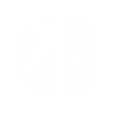

# Light is Green



> **Official v1.0.0 / Versión oficial v1.0.0**

[English](#english) · [Español](#español)

## English

Light is Green is an independently maintained, open-source Cloud Play and
Remote Play client for Nintendo Switch homebrew. Authentication, catalogue,
native WebRTC streaming, hardware H.264 decoding, GPU presentation, audio, and
controller input run on the console—no companion PC is required.

### v1.0.0 — official identity

- Original Light is Green mark and aurora background, compact command-deck
  header, dark glass panels, and restrained emerald focus motion.
- A content-first 6 × 3 library retains 18 visible games, uncropped cover art,
  readable card titles, and a full selected-title marquee.
- Redesigned game details and source selection use complete titles and real
  Cloud Play / Remote Play actions.
- Cloud Launch reports only actual values: Session → ICE → DTLS → Video stages,
  effective Xbox server region, source, and configured quality.
- New data location: `sdmc:/switch/light-is-green/`. At first launch, v1
  non-destructively imports account data, settings, favourites, history, and
  cached server regions when the new files do not already exist. The prior
  folder and its cover-art cache remain untouched.

### Catalogue scope

The library intentionally shows only cloud-playable games returned for the
signed-in account: Game Pass titles, eligible Stream Your Own Game / BYOG
titles, and eligible free-to-play titles. It is **not** a view of the full Xbox
Store. Duplicate entitlements are merged and each title launches through the
offering that granted access.

### Features

- Microsoft device-code sign-in; no password is entered on the console.
- Search, favourites, history, multiple accounts, and contained cover art.
- Cloud Play plus Remote Play from a linked Xbox console. Remote availability
  depends on Xbox Remote Features, NAT, IPv6/Teredo, and UDP connectivity.
- Native WebRTC media path, hardware H.264 decode, zero-copy deko3d video,
  Opus audio, and Switch controller support.
- Game Pass / Owned & Free tabs, server-region selection, optional region
  bypass, quality and bitrate controls, language, mapping, vibration, pacing,
  picture controls, and in-stream diagnostics.

### Requirements and installation

1. Use a Nintendo Switch with [Atmosphère](https://github.com/Atmosphere-NX/Atmosphere)
   custom firmware, a Microsoft/Xbox account, and preferably 5 GHz Wi-Fi or
   docked Ethernet.
2. Copy `Light_is_Green-v1.0.0.nro` to `sdmc:/switch/`.
3. Launch in **title mode** by holding **R** while opening an installed game.
   Applet mode does not provide enough memory for hardware video decoding.
4. Enter the displayed device code at `microsoft.com/link`.

### Controls

| Context | Controls |
| --- | --- |
| Library | Left stick / d-pad: move · **A**: details/play · **Y**: search · **X**: favourite · **ZR**: refresh · **ZL**: settings · **+**: exit |
| Settings | Left/right: change · **A**: open/confirm · **B**: back |
| In stream | Tap **••**: picture/performance panel · tap the small Xbox symbol or press **L3 + R3**: Guide · hold **−** + **+**: leave stream |

### Build

```sh
bash deps/build-switch.sh
docker run --rm -v "$PWD":/src -w /src devkitpro/devkita64 make
```

The output is `Light_is_Green-v1.0.0.nro`. The desktop core harness builds with
`make -f Makefile.pc`.

### License and third-party notices

Light is Green is an experimental, non-commercial hobby project provided as-is.
It is not affiliated with, endorsed by, or supported by Microsoft or Nintendo.
The project is distributed under [GPL-3.0](LICENSE); see [NOTICE](NOTICE) for
modified-work and third-party notice guidance.

---

## Español

Light is Green es un cliente de Cloud Play y Remote Play para homebrew de
Nintendo Switch, mantenido de forma independiente y de código abierto. La
autenticación, catálogo, streaming WebRTC nativo, decodificación H.264 por
hardware, presentación en GPU, audio y controles funcionan en la consola: no
requiere una PC auxiliar.

### v1.0.0 — identidad oficial

- Icono y fondo aurora originales, cabecera compacta tipo consola, paneles de
  vidrio oscuro y foco verde con movimiento discreto.
- Biblioteca 6 × 3 centrada en contenido: 18 juegos visibles, carátulas sin
  recorte, títulos legibles y marquee completo para el juego seleccionado.
- Ficha y selector de origen rediseñados, con títulos completos y acciones
  reales de Cloud Play / Remote Play.
- Cloud Launch muestra sólo valores reales: fases Session → ICE → DTLS → Video,
  región efectiva devuelta por Xbox, origen y calidad configurada.
- Nueva carpeta de datos: `sdmc:/switch/light-is-green/`. En el primer inicio,
  v1 importa cuentas, ajustes, favoritos, historial y regiones guardadas de
  forma no destructiva cuando los archivos nuevos todavía no existen. La carpeta
  anterior y su caché de carátulas no se modifican.

### Alcance del catálogo

La biblioteca muestra intencionalmente sólo juegos cloud jugables que Xbox
devuelve para la cuenta iniciada: títulos de Game Pass, títulos elegibles de
Stream Your Own Game / BYOG y títulos elegibles free-to-play. **No** es una
vista de toda la tienda Xbox. Las licencias duplicadas se unifican y cada juego
se abre con la oferta que concede el acceso.

### Funciones

- Inicio de sesión de Microsoft por código de dispositivo; la contraseña no se
  escribe en la consola.
- Búsqueda, favoritos, historial, varias cuentas y carátulas sin recorte.
- Cloud Play y Remote Play desde una Xbox vinculada. El acceso remoto depende de
  Xbox Remote Features, NAT, IPv6/Teredo y conectividad UDP.
- Ruta multimedia WebRTC nativa, decodificación H.264 por hardware, video
  deko3d sin copias adicionales, audio Opus y controles de Switch.
- Pestañas Game Pass / Propios y gratis, región de servidor, bypass regional
  opcional, calidad, bitrate, idioma, mapeo, vibración, pacing, imagen y
  diagnósticos durante el stream.

### Requisitos e instalación

1. Usa una Nintendo Switch con firmware personalizado
   [Atmosphère](https://github.com/Atmosphere-NX/Atmosphere), una cuenta
   Microsoft/Xbox y preferiblemente Wi-Fi de 5 GHz o Ethernet por dock.
2. Copia `Light_is_Green-v1.0.0.nro` a `sdmc:/switch/`.
3. Ábrelo en **modo título**, manteniendo **R** al abrir un juego instalado.
   El modo applet no tiene memoria suficiente para video por hardware.
4. Ingresa el código mostrado en `microsoft.com/link`.

### Controles

| Contexto | Controles |
| --- | --- |
| Biblioteca | Stick izquierdo / cruceta: mover · **A**: detalles/jugar · **Y**: buscar · **X**: favorito · **ZR**: actualizar · **ZL**: ajustes · **+**: salir |
| Ajustes | Izquierda/derecha: cambiar · **A**: abrir/confirmar · **B**: volver |
| En stream | Toca **••**: panel de imagen/rendimiento · toca el símbolo pequeño de Xbox o pulsa **L3 + R3**: Guide · mantén **−** + **+**: salir del stream |

### Compilación

```sh
bash deps/build-switch.sh
docker run --rm -v "$PWD":/src -w /src devkitpro/devkita64 make
```

El resultado es `Light_is_Green-v1.0.0.nro`. El entorno de pruebas del núcleo
para PC se compila con `make -f Makefile.pc`.

### Licencia y avisos de terceros

Light is Green es un proyecto experimental, no comercial y de afición, entregado
tal cual. No está afiliado, respaldado ni soportado por Microsoft o Nintendo.
Se distribuye bajo [GPL-3.0](LICENSE); consulta [NOTICE](NOTICE) para los avisos
de obra modificada y de terceros.
