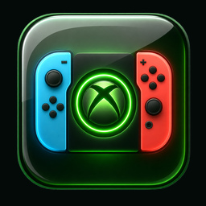
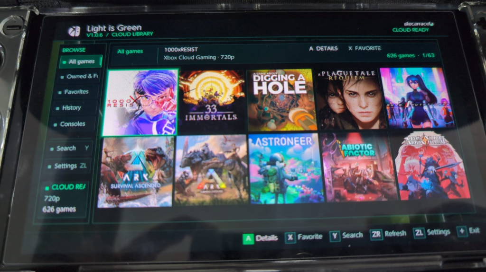
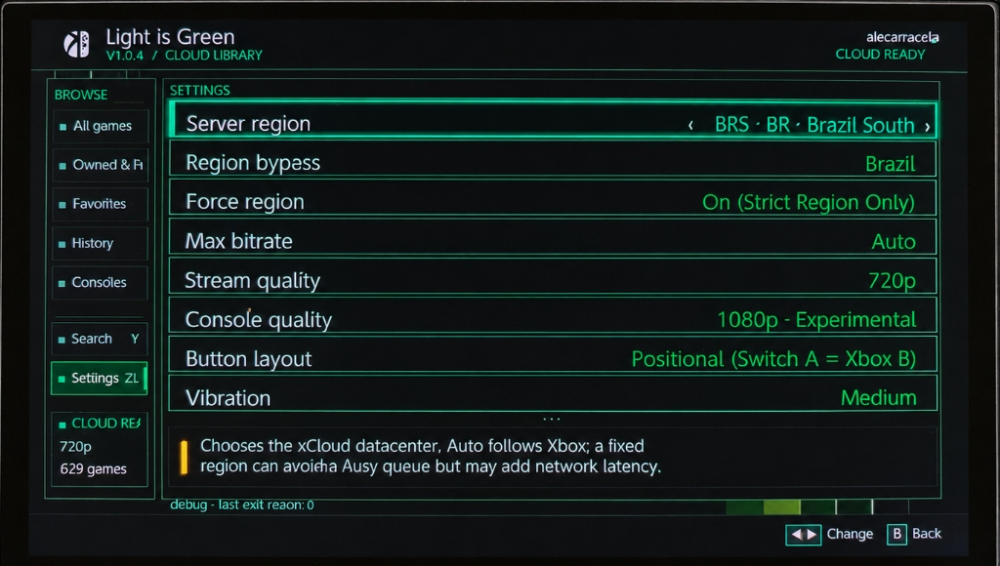
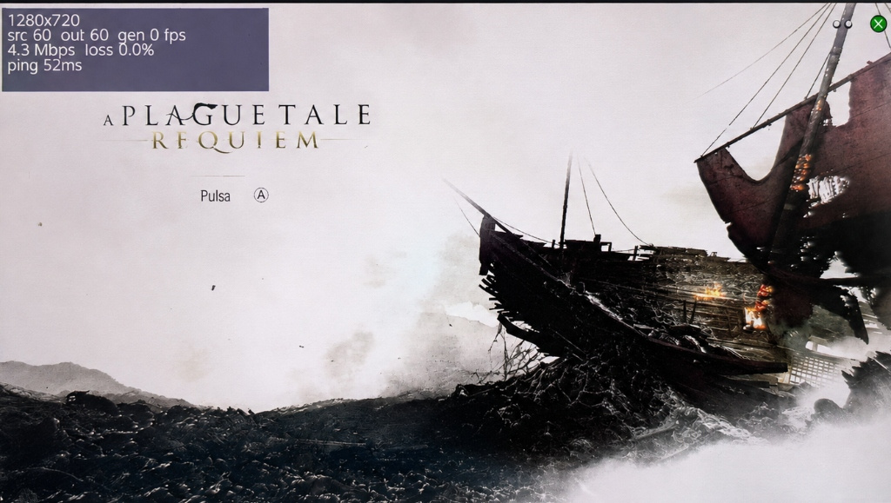
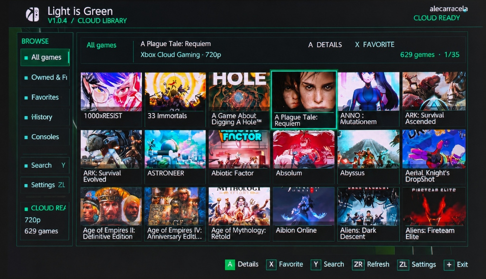
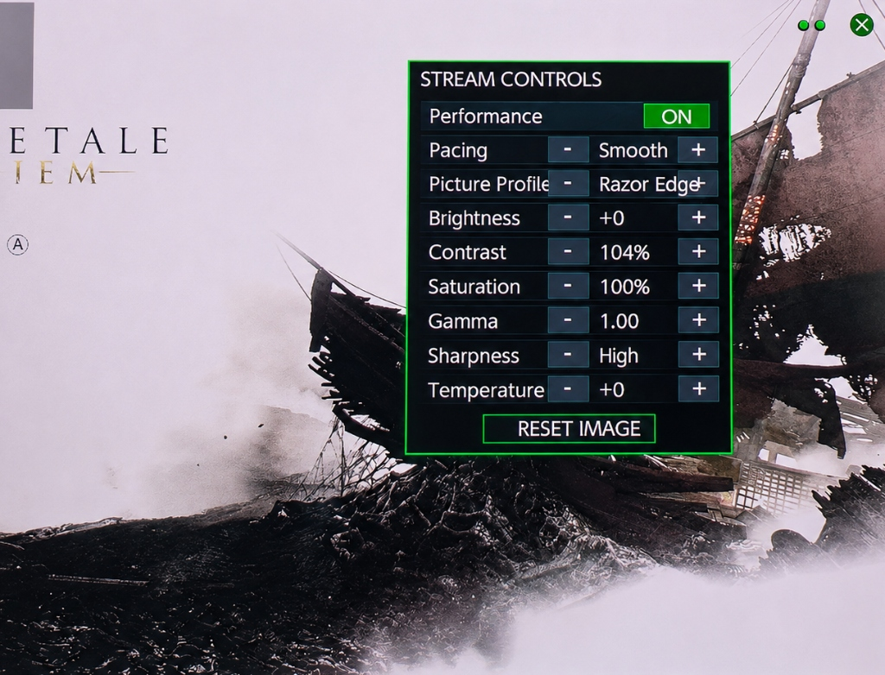

# Light is Green

  

> **Official v1.0.6 / Versión oficial v1.0.6**

[English](#english) · [Español](#español)

---

## Showcase / Galería de Capturas

  
  
  
  

---

## English

Light is Green is an independently maintained, open-source Cloud Play and Remote Play client for Nintendo Switch homebrew. Authentication, catalogue, native WebRTC streaming, hardware H.264 decoding, GPU presentation, audio, and controller input run directly on the console—no companion PC required.

### What's New in v1.0.6

- **Clean 5 × 2 Library Grid**: Redesigned library layout displaying larger, high-resolution square Xbox BoxArt covers without text clutter under cards. Full game titles are displayed in the top status panel when focused.
- **Pure Edge-to-Edge Artwork**: Removed dark padding and ambient borders around covers for a sleek, modern look.
- **Instant Picture & Color Controls**: Fine-tuned Quick Menu ("••") picture controls (Contrast, Saturation, Gamma, Brightness, and Temperature) with responsive step sizes for real-time video adjustments while streaming.
- **Icon & Aurora Theme Art**: Featuring custom app icon and background artwork created by **@Djihads80**.
- **Performance & Navigation**: Preserved full touch controls, D-pad/stick navigation, focus memory, and fast pagination.

### Features

- Microsoft device-code sign-in; no password entered on the console.
- Search, favourites, history, multiple accounts, and square cover art caching.
- Cloud Play plus Remote Play from a linked Xbox console.
- Native WebRTC media path, hardware H.264 decode, zero-copy deko3d video, Opus audio, and Switch controller support.
- Game Pass / Owned & Free tabs, server-region selection, optional region bypass, quality and bitrate controls, language, mapping, vibration, pacing, picture controls, and in-stream diagnostics.

### Requirements and Installation

1. Use a Nintendo Switch with [Atmosphère](https://github.com/Atmosphere-NX/Atmosphere) custom firmware, a Microsoft/Xbox account, and 5 GHz Wi-Fi or docked Ethernet.
2. Copy `Light_is_Green-v1.0.6.nro` to `sdmc:/switch/`.
3. Launch in **title mode** by holding **R** while opening an installed game (Applet mode lacks sufficient RAM for hardware video decoding).
4. Enter the displayed device code at `microsoft.com/link`.

---

## Español

Light is Green es un cliente de Cloud Play y Remote Play para homebrew de Nintendo Switch, mantenido de forma independiente y de código abierto. La autenticación, catálogo, streaming WebRTC nativo, decodificación H.264 por hardware, presentación en GPU, audio y controles funcionan directamente en la consola: no requiere PC auxiliar.

### Novedades en v1.0.6

- **Nueva Grilla Limpia 5 × 2**: Biblioteca rediseñada con carátulas cuadradas nativas de Xbox en alta resolución, más grandes y sin nombres debajo de las tarjetas. El título completo aparece en el panel superior al seleccionar cada juego.
- **Arte Puro sin Bordes**: Se eliminaron los bordes oscuros y el relleno ambiental alrededor de las carátulas para una experiencia visual limpia y de aspecto premium.
- **Controles de Imagen al Instante**: Menú rápido ("••") optimizado con saltos ágiles para Contraste, Saturación, Gamma, Brillo y Temperatura con vista previa en tiempo real durante el juego.
- **Icono y Tema Visual**: Incluye el nuevo icono oficial de la app y el fondo arte creados por **@Djihads80**.
- **Navegación Intacta**: Conserva la navegación táctil, cruceta/stick, memoria de foco y paginación veloz.

### Funciones

- Inicio de sesión por código de dispositivo Microsoft sin ingresar contraseña en la consola.
- Búsqueda, favoritos, historial, gestión de múltiples cuentas y caché optimizada de portadas.
- Cloud Play y Remote Play desde consola Xbox vinculada.
- Decodificación H.264 por hardware, renderizado deko3d de cero copias, audio Opus y soporte completo de controles.

### Requisitos e Instalación

1. Usar Nintendo Switch con [Atmosphère](https://github.com/Atmosphere-NX/Atmosphere), cuenta Microsoft/Xbox y conexión Wi-Fi de 5 GHz o Ethernet.
2. Copiar `Light_is_Green-v1.0.6.nro` a `sdmc:/switch/`.
3. Abrir en **modo título** (manteniendo **R** al iniciar cualquier juego instalado).
4. Ingresar el código en `microsoft.com/link`.

### Créditos

- Desarrollo y mantenimiento: **elzerdodata**
- Proyecto base original: **rmrf404** ([green-nx](https://github.com/rmrf404/green-nx))
- Arte de icono y fondo visual: **@Djihads80**

### Licencia

Distribuido bajo la licencia [GPL-3.0](LICENSE).
